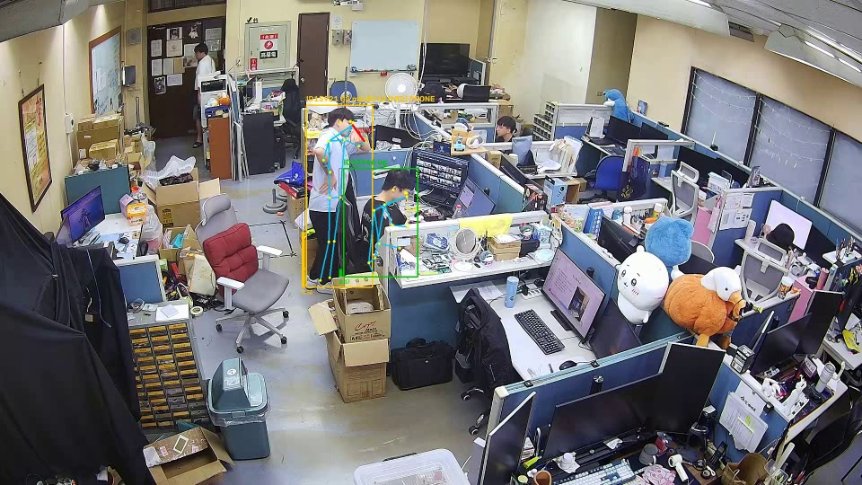
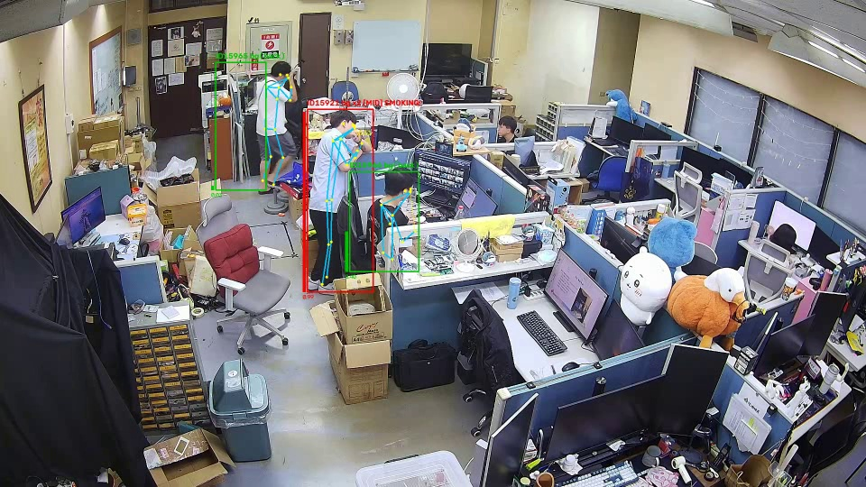
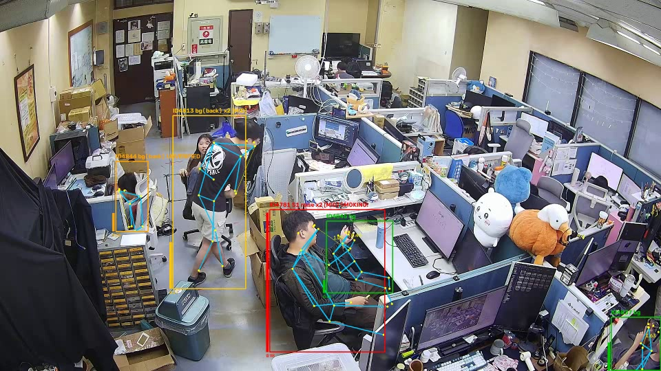
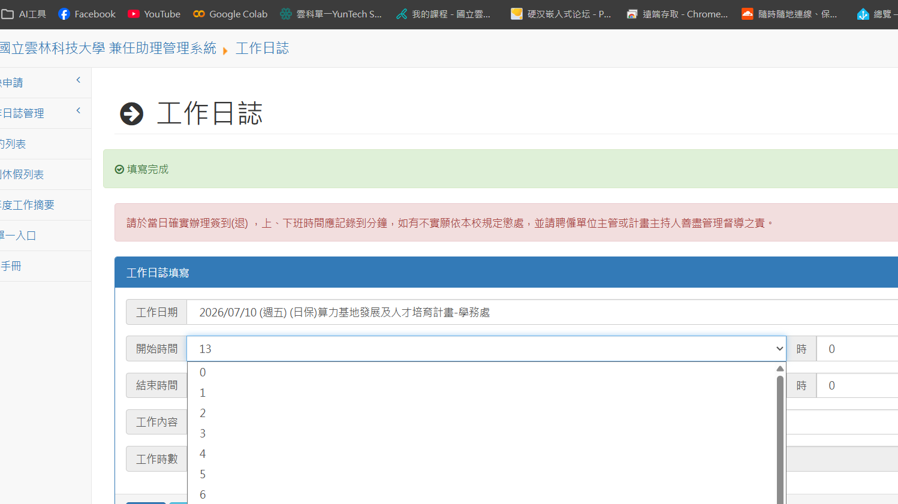

# 基於動作時序分析之無菸物件抽菸行為偵測系統 — 報告

Demo 影片:`docs/demo/demo1_站立抽菸_警報觸發.mp4`(單人站立,完整觸發流程)、
`docs/demo/demo2_多人場景_排除與分流.mp4`(多人同框,排除條件與警示分流)
——皆為系統於實驗室監控攝影機**實際運行時自動錄下**的警報片段。

---

## 一、動機與目的

現行抽菸偵測方案多以物件偵測直接尋找「香菸」,存在根本性限制:
監控距離下香菸僅佔數個像素、易受手掌與口罩遮擋、逆光與低照度下幾乎
不可見,且電子菸等新型態產品外觀差異大,物件偵測模型難以泛化。

本研究改採**動作時序分析**路線:抽菸是一個具有明確結構的週期性行為
——舉手靠近嘴(S1)、停留吸食(S2)、放下(S3)、間隔重複——
此時序模式在統計上可與喝水、講電話、擦嘴等混淆動作區分。
**不偵測「菸」,而偵測「抽菸這個動作序列」。**

研究目的:

1. 建立不依賴香菸物件、支援多人場景的即時抽菸行為偵測系統
2. 提出以特徵圖通道作為多幀時序緩衝(channel-as-temporal-buffer)的
   輕量時序建模架構,全程僅用 2D 卷積算子,保留向邊緣 NPU 移植性
3. 以「高召回優先」為設計原則:不漏測,誤測以多層行為語意排除條件
   與人工複查分流控制
4. 於單卡 RTX 2060(6GB VRAM)完成全部訓練與即時推理

## 二、系統功能

| 類別 | 功能 |
|------|------|
| 即時偵測 | 多人追蹤(每人獨立狀態)、RTSP 監控串流直連(斷線自動重連、延遲不累積)、1080p 實測特徵率 8+ fps(RTX 2060) |
| 行為判定 | 手到嘴停留時長三分類(<2 秒扶眼鏡/戴耳機不計、**2~5 秒計為抽菸的一口**、>5 秒判講電話);90 秒視窗內事件次數警戒分級(1 次低/2 次中/≥3 次高);次數達門檻且無排除條件才通報 |
| 誤報防護 | 背向棄權(2D 腕鼻距離不可信)、移動排除(走動中不計)、講電話即時判定、「由遠而近」武裝機制(阻擋手被遮擋時的關鍵點幻覺) |
| 警示分流 | 無法確認(背向但網路分數高)與逗留警告以橘色分流待人工複查,不誤報也不靜默;hard case 自動存檔供重訓 |
| 介面 | GUI 即時調整所有門檻(觸發/解除/次數/停留窗/移動排除);骨架與腕-鼻距離可視化;警報記錄條列分頁;**警報自動錄「前 10 秒+後 4 秒」片段,雙擊回放** |

## 三、系統架構

```
影像來源(RTSP 串流 / 攝影機 / 檔案)
  → YOLOv8-pose:人物框 + 17 關鍵點(一次前向)
  → ByteTrack 多人追蹤(每人一個 track,獨立維護所有狀態)
  → 每 track 雙分支:
      ├ 外觀分支:上半身 ROI(EMA 平滑)→ 共享 2D backbone 單幀特徵
      │            → 雙時間尺度環形緩衝(短 T=16,s=1/長 T=16,s=8)
      │            → 純 2D 時序融合頭 → 網路分數
      └ 規則分支:腕-鼻正規化距離 → 停留時長分類 → 手到嘴事件計數
  → 通報邏輯:排除條件(背向/移動/講電話)∧ 事件次數 ≥ N ∧ 持續確認
  → 輸出:紅色警報(截圖+片段錄製)/ 橘色警示(無法確認、逗留)
```

兩分支互補:外觀分支涵蓋骨架失效的情境(遠距、部分遮擋),
規則分支提供可解釋性(畫面直接看得到「手到嘴」被偵測)與
不需階段標籤即可運作的行為結構驗證。

## 四、主要方法

### 4.1 Channel-as-Temporal-Buffer 時序建模(核心)

每幀影像經共享權重 2D backbone 產生 C×H×W 特徵圖推入環形緩衝;
推理時將最近 T 幀沿**通道軸**疊成 (T·C)×H×W,通道排列採 interleave
`[c0t0, c0t1, …, c0t15, c1t0, …]`,使
`Conv2d(T·C→T·C, kernel=1, groups=C)` 的每一組恰好包含同一特徵通道
的 T 個時刻——**等價於時間卷積攤平為 2D 運算**。

- 全模型僅含 Conv2d/BN/activation/pooling/Linear(單元測試強制白名單),
  無 Conv3D/LSTM/attention,可直接移植邊緣 NPU
- **Continual inference**:新幀僅前向一次 backbone、重算時序頭,
  算力為滑動視窗重算法的 1/T
- 雙時間尺度分別對應單次動作(~2 秒)與週期重複(~13 秒)

### 4.2 骨架規則分支與行為語意

以腕-鼻距離 `d = dist(腕,鼻) / max(肩寬, 0.55×軀幹高)` 判定手是否在
臉部區域——除以身體自身尺度使判定**與攝影機距離無關**;軀幹高一項
補償側面視角肩寬被透視壓縮的問題;太遠(尺度<24px)棄權並附
距離自適應誤差餘裕。

在此之上疊三層行為語意(均為實測誤報驅動的設計):

1. **停留時長三分類**:同樣「手在臉部」,<2 秒是扶眼鏡、2~5 秒是
   吸一口菸、>5 秒不放下是講電話——把領域知識變成零訓練成本的分類器
2. **「由遠而近」武裝機制**:手被遮擋(背在身後)時姿態模型會以高
   置信度(實測 0.83–0.98)把腕點幻覺在身體輪廓上,置信度門檻無效;
   但幻覺點恆定懸停、**從不先遠離再靠近**,而真的吸一口必先舉手——
   故 S2 僅在「手曾離臉夠遠」後採信,每口之間須重新武裝
3. **朝向判斷與背向棄權**:利用 COCO 關鍵點左右語意(背對時左右肩
   x 順序顛倒)判定背向;背向時 2D 距離無意義,骨架棄權、
   不誤報也不倒扣,網路分數仍高者分流為橘色「無法確認」

### 4.3 通報邏輯(次數主導)

紅色警報 = **非背向 ∧ 非移動中 ∧ 非講電話 ∧ 有效事件 ≥ N(可調)**,
成立後分數推滿、EMA 累積持續超過觸發線 2 秒才通報;解除採雙門檻
hysteresis 防抖。對應行為本質:單次手到嘴什麼都不是,**重複才是抽菸**。

### 4.4 訓練(單卡 6GB VRAM)

離線特徵抽取(fp16 落地)→ 階段一僅訓時序頭(batch 256)→
階段二端到端微調(AMP + 梯度累積 + backbone 差分學習率);
X3D-M 離線蒸餾管線已備妥(師生不同時佔用 VRAM)。
資料以 HMDB51 子集起步(smoke/drink/eat/chew/talk 共 610 段),
由本系統的偵測追蹤管線自動產生人物框標註。

## 五、實驗

(待補——實驗設計與數表結構已定,數據量測後填入)

- 5.1 Clip 級分類:accuracy / macro-F1 / AUC,smoking vs 各 hard negative
- 5.2 即時系統效能:特徵率、單步延遲、多人負載
- 5.3 誤報防護消融:各排除條件(停留窗/武裝/背向/移動)開關前後的
  誤報頻率對比
- 5.4 事件級指標:precision / recall(時間 IoU≥0.3)、FP/h、警報延遲

## 六、系統展示

**Demo 1(單人觸發流程)**:站立受試者做出重複手到嘴動作,
畫面即時顯示骨架與腕-鼻距離線(S2 時紅色加粗),事件計數
逐次上升(x1 [LOW] → x2 [MID]),達通報條件後轉為紅色 SMOKING 警報。


圖 1:手到嘴動作進行中——骨架、腕-鼻距離線與事件計數即時標示。


圖 2:第 2 次有效停留後觸發紅色警報(SMOKING!),同時自動錄製片段。

**Demo 2(多人場景與分流)**:同框多人各自獨立判定——背向者標示
`(back)` 骨架棄權、網路分數偏高者以橘色 UNVERIFIED 分流待複查、
一般工作者維持綠框,警報者紅框,互不干擾。


圖 3:多人同框:紅色警報、橘色無法確認、背向棄權標示並存。


圖 4:Demo GUI——追蹤狀態面板、門檻即時調整、警報記錄與片段回放。

## 七、結論

本研究完成一套不依賴香菸物件的抽菸行為偵測系統:以
channel-as-temporal-buffer 達成純 2D 算子、continual inference 的
輕量時序建模;以骨架規則分支疊加停留時長、由遠而近武裝、朝向判斷等
行為語意,將「手在臉部」的先天歧義逐層收斂;以次數主導通報與
橘色分流實現「高召回優先、誤報可控可複查」的實用警報策略。
系統已於實驗室監控攝影機長時間實際運行,具備多人、RTSP、
片段回放與 hard case 自動累積等完整工程能力。

目前限制:外觀網路以電影片段(HMDB51)訓練,對監控俯視角存在
domain gap;單目 2D 無法驗證背向的手到嘴。誤測經多層排除後仍高於
理想水準——此為下一階段工作的直接動機。

## 八、未來工作

**核心方向:pose 節點時序的第二階段過濾(級聯驗證)。**

第一階段(現行系統)維持高召回,負責圈出「高機率抽菸」的候選並
自動錄下該人物 bounding box 範圍的影像;第二階段對候選做更強的
時序行為驗證:

1. **記錄 pose 節點時序**:對候選 track 連續記錄 17 個關鍵點
   (x, y, conf)的時間序列,與既有的事件時間戳對齊
2. **節點數據正規化**:以人物自身尺度(肩寬/軀幹高)與身體中心做
   位置及大小正規化,消除攝影機距離、人物位置與解析度的影響——
   使不同距離、不同鏡位的動作落在同一特徵空間
3. **時序相關模型過濾**:將正規化後的節點序列(必要時聯合手-嘴
   區域外觀嵌入)輸入時序模型(TCN / GRU / 輕量 Transformer——
   第二階段離線執行,不受邊緣算子限制),學習抽菸特有的長時窗
   動作結構與**節律**(口與口的間隔規律性、每口動作的相似度),
   區分抽菸與喝水、講電話等混淆行為
4. **降級不否決**:第二階段判定非抽菸時,將紅色警報降為橘色
   「待人工複查」,而非直接取消——召回由結構保證不下降;
   確認為抽菸才維持紅色,誤報由此收斂

配套工作:目標場域自錄資料集(第一階段已自動累積 hard negative,
補齊正樣本後即可訓練)、track 長時連續性強化(必要時輕量 re-ID)、
知識蒸餾與事件級評估(FP/h、警報延遲),以及邊緣平台部署驗證。
